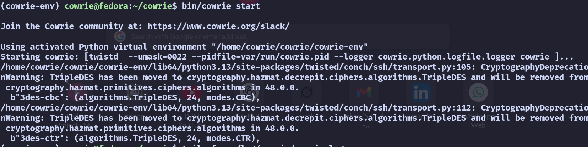
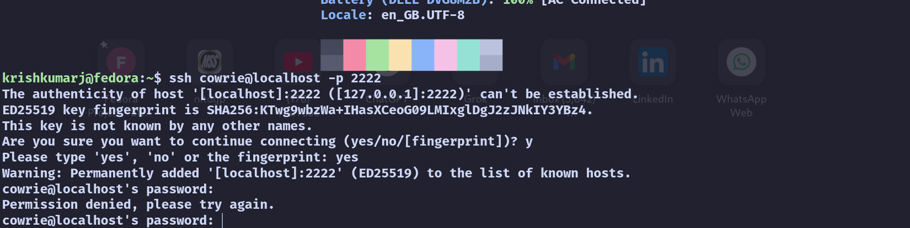
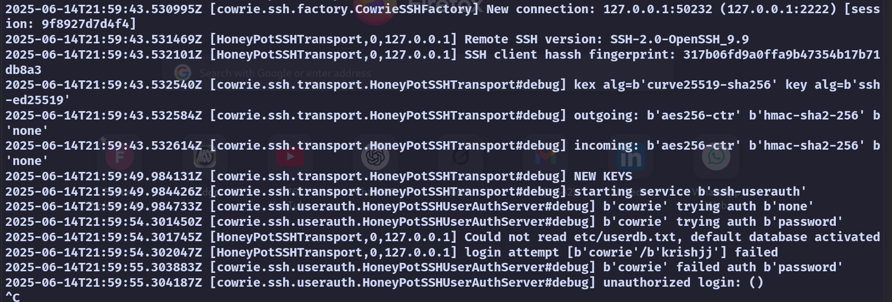

# Honeypot-testing-catching-hackers
Catching hackers with Honeypot 

# SSH Honeypot using Cowrie on Fedora Linux

This project is a simple but effective SSH honeypot built using **Cowrie** on a Fedora Linux system. It simulates a fake SSH server to catch and record unauthorized login attempts. The goal was to learn how attackers behave, how honeypots work, and how to build one safely on my own system.

---

## Why I Built This

I’m passionate about cybersecurity and wanted to go beyond theory. So I set up a honeypot to:
- Understand attacker behavior in a controlled environment
- Gain hands-on experience with security tools like Cowrie
- Learn to manage Python environments and Linux security

---

## What the Honeypot Does

Once running, the honeypot:
- Listens on port `2222` (instead of 22, for safety)
- Pretends to be a real SSH server
- Logs login attempts, passwords, and even commands entered
- Never gives attackers access to the real system

It’s isolated using a separate Linux user and virtual environment.

---

## How It Looks

Here’s what I captured during the setup and testing:
- Cowrie running and waiting for connections
- A fake attacker trying to SSH in
- Real-time logging of their activity
- Session logs saved for analysis
- 
### HOW IT STARTS

### TRYING TO HACK

### HONEYPOT PROTECTS

---

## Commands Used

Here’s a full list of commands I used to set everything up:
# System Update and Package Installation
sudo dnf update
sudo dnf install git python3 python3-venv libffi-devel gcc \
                 python3-devel libxslt-devel openssl-devel \
                 libselinux-python3 -y

# Add a dedicated non-root user for Cowrie
sudo adduser cowrie
sudo passwd cowrie
su - cowrie

# Clone Cowrie Repository and Set Up Environment
git clone https://github.com/cowrie/cowrie.git
cd cowrie
python3 -m venv cowrie-env
source cowrie-env/bin/activate
pip install --upgrade pip
pip install -r requirements.txt
cp etc/cowrie.cfg.dist etc/cowrie.cfg

# Start Cowrie Honeypot
bin/cowrie start

# View Cowrie Logs in Real-Time
tail -f var/log/cowrie/cowrie.log

# Test Honeypot from another terminal (as normal user)
ssh cowrie@localhost -p 2222

# Stop Cowrie and Safely Exit
bin/cowrie stop
deactivate
exit

